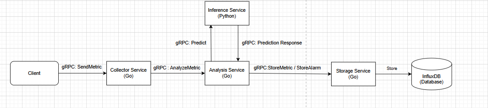
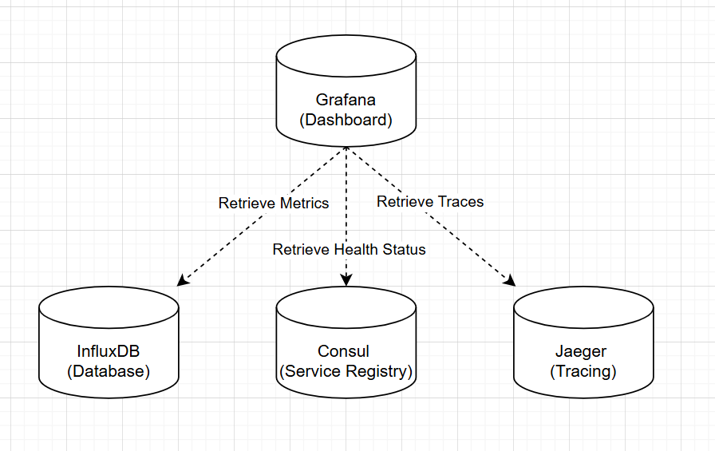
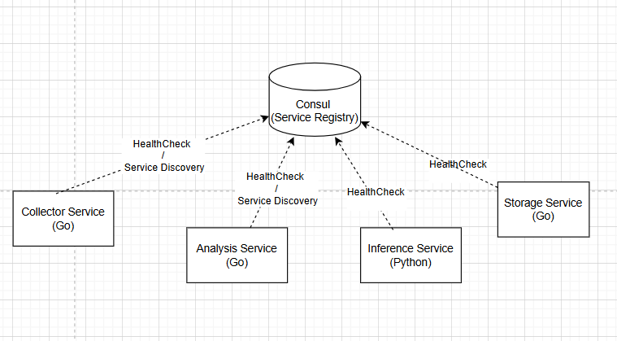
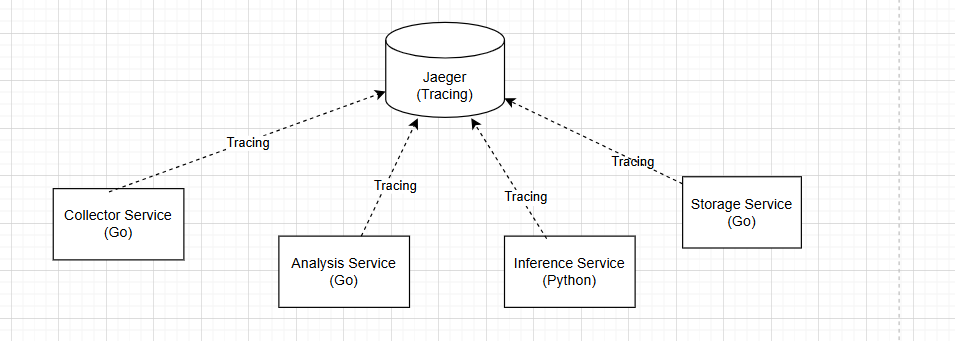

# Distributed Intrusion Detection System

A coursework project for Distributed Systems and Cloud Computing, built with Go, Python, gRPC and Docker Compose. The system processes network-traffic records, detects anomalies with an Isolation Forest model, correlates suspicious events by client and stores metrics and alarms in InfluxDB.

The test client replays NSL-KDD records. It does not capture live network packets or perform the attacks described by the dataset labels.

## Architecture

| Service | Responsibility |
| --- | --- |
| Collector, Go | Receive metrics over gRPC, discover healthy analysis instances and route clients using a hash of their identifier |
| Analysis, Go | Request a prediction, apply circuit-breaker fallback and correlate anomalies within a time window |
| Inference, Python | Serve the saved Isolation Forest model over gRPC; return `1` for normal traffic and `-1` for an anomaly |
| Storage, Go | Write traffic metrics and correlated alarms to separate InfluxDB buckets |

Consul provides service discovery and health checks. OpenTelemetry exports distributed traces to Jaeger. Grafana displays metrics, traces and service information. Compose starts two analysis replicas. Routing uses the client identifier and the current discovery list. A change in the list's order or healthy instances can move a client to another replica; correlation history is kept in memory and is not replicated between instances.



## Run locally

Requirements: Docker Engine with Docker Compose, GNU Make, and Go 1.23.11 or newer for the client and Go tests. Run the commands from the repository root.

```bash
make up
docker compose ps
```

`make up` rebuilds the images without the build cache, then starts the services. After InfluxDB is ready, create the alarms bucket on the first run:

```bash
make create-alarms-bucket
```

InfluxDB creates the `metrics` bucket during initialisation. The command above creates the separate `alarms` bucket; it is not necessary if that bucket already exists in the persistent volume.

Generate traffic in a second terminal:

```bash
make test-client-benign
make test-client-malicious
```

Each command starts five concurrent clients with 200 records per client. The two modes select normal or attack-labelled records from `KDDTest+.txt`.

For a shorter run, use the client flags directly:

```bash
go run ./cmd/test-client -mode=benign -addr=localhost:50051 -clients=1 -records=20 -delay=500
```

`-records=0` runs continuously. Keep `-delay` positive. The client derives categorical encodings from the root `KDDTrain+.txt`, using the same alphabetical ordering as the training script's LabelEncoder. Unknown categories currently map to zero.

## Interfaces and observability

| Interface | URL |
| --- | --- |
| Grafana | http://localhost:3000 |
| Jaeger | http://localhost:16686 |
| Consul | http://localhost:8500 |
| InfluxDB | http://localhost:8086 |

Grafana starts with `admin` / `admin`. The Compose credentials and tokens are demo defaults for this local environment.

The Grafana provisioning directory and dashboard are mounted by Compose, with consistent datasource UIDs. The Infinity plugin is installed at startup using [Grafana's plugin preinstallation setting](https://grafana.com/docs/grafana/latest/administration/plugin-management/plugin-install/), which requires internet access on the first start.

```bash
make logs
```

Screenshots from the original project:





## Detection and fallback

The analysis service uses these Compose defaults:

- `ALARM_THRESHOLD=4`: correlate four anomalies from the same client before emitting an alarm.
- `ALARM_WINDOW_SECONDS=60`: retain anomalies within a 60-second window.
- `FALLBACK_THRESHOLD=95.0`: if inference fails or the circuit breaker is open, compare the metric's value, or feature 4 (`src_bytes`) when that value is zero, against this threshold.

To exercise fallback while the client is running:

```bash
docker compose stop inference
docker compose logs -f analysis
```

Restart inference with `docker compose start inference`. The fallback is a simple threshold rule, not an equivalent replacement for the trained model.

## Tests and build checks

```bash
make test-unit
go build ./... ./pkg/consul/... ./pkg/tracing/... ./tests/...
```

Unit tests cover record conversion, categorical encoding, normal metrics, correlated alarms and inference-failure fallback. They use mock services and do not require Docker.

System tests require the running stack and both InfluxDB buckets:

```bash
make test-system
make test
```

`make test` explicitly includes the separate `tests` Go module. System tests send records to the collector, query InfluxDB and include a resilience scenario that stops inference.

## Model and dataset

The repository includes `KDDTrain+.txt`, `KDDTest+.txt` and the saved model at `services/inference/isolation_forest_model.joblib`. Training uses 41 features, encodes categorical columns with LabelEncoder and fits an Isolation Forest with 100 estimators and `random_state=42`. Dataset labels are excluded from fitting.

Use Python 3.12 and the pinned Python environment to retrain:

```bash
python3.12 -m venv .venv
source .venv/bin/activate
python -m pip install -r services/inference/requirements.txt
python ml-training/train_model.py
```

Check the saved model and the Python gRPC interface without starting Consul or Docker:

```bash
python -m unittest discover -s services/inference -p 'test_*.py'
```

The training script resolves paths relative to its location and overwrites the saved model. The committed model was created with scikit-learn 1.7.0; the inference requirements retain that version. Prediction output and unit tests do not establish detection accuracy. There is no verified classification benchmark in this repository.

## Stop and clean up

```bash
make down
```

`make down` and `make clean` stop containers and preserve volumes. `make clean-all` also deletes the InfluxDB and Grafana volumes. The `clean-influx` and `clean-grafana` targets remove the respective named volume; check its Compose project prefix when using them.

The AWS targets and PowerShell script are inherited deployment helpers. Configure their host and SSH-key settings for your own environment before using remote commands.

## Verification status

Checked with Go 1.23.11 and Python 3.12: unit tests, Go compilation across all four modules, saved-model loading with scikit-learn 1.7.0, and a local gRPC prediction request. The training script also completed on all 125,973 training records in an isolated directory, preserving the committed model. Compose configuration and Grafana datasource references were checked statically.

The complete Docker stack, system tests and restored Grafana provisioning have not been rerun in the current recovery environment, which has no Docker daemon.
